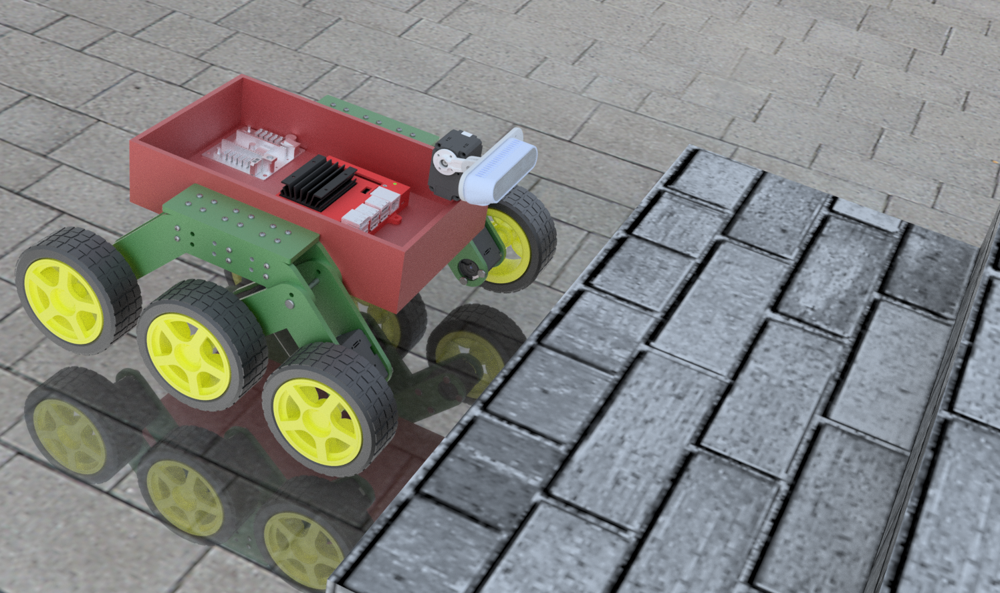
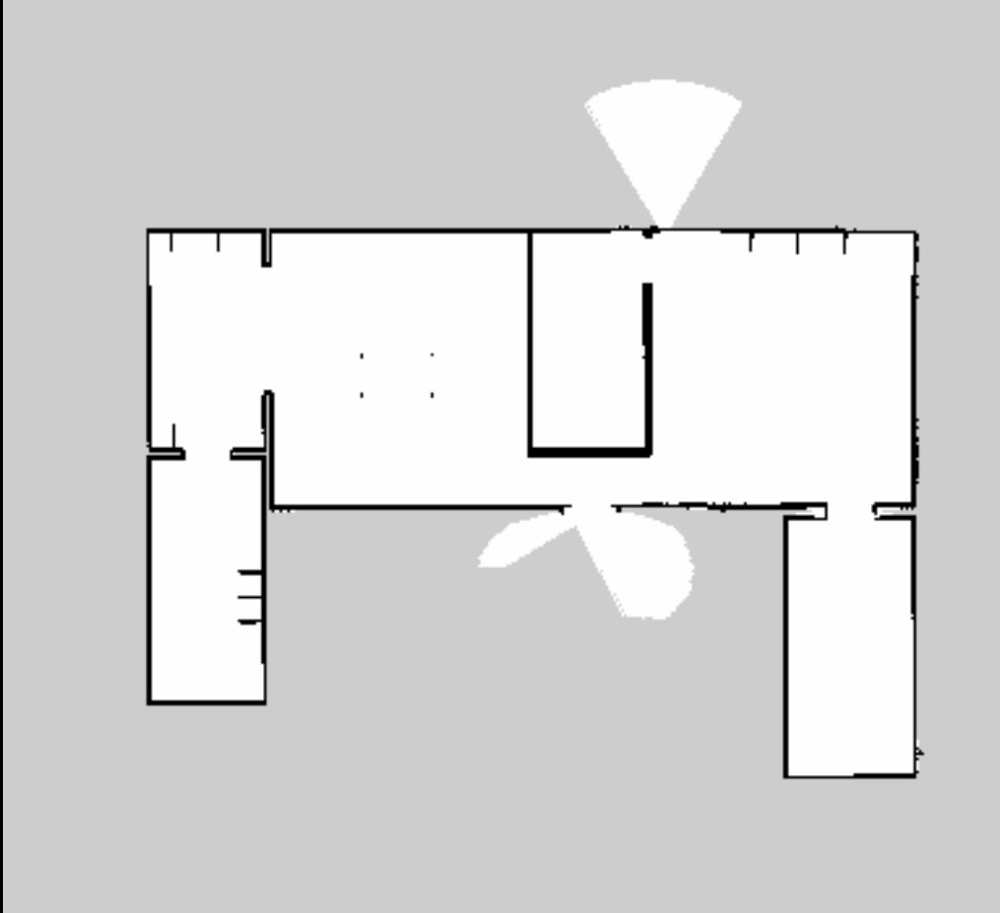

# 6 wheeled Autonomous Navigation Robot


<p align="center">
    
    
</p>

This codebase uses a ...

The algorithm can: 
- classify stairs as either ascending or descending
- identify the number of steps
- identify the dimensions of the stairs (length, width, height)
- predict the distance from the camera to the staircase
- create a segmentation mask over the detected stairs


## Improvements

This implementation was made for RGBD cameras with ROS pointcloud topics. Any RGBD camera with a ROS pointcloud topic should be compatible with this implementation.

Various changes were made to improve this codebase:

- Implemented better segmentation masks for descending stairs
- Tweaked parameters for better stair detection
- Implemented more memory-efficient code
- Removed unnecessary functions or code

## Installation

#### Requirements

This implementation was successfully run on Ubuntu 18.04.6 LTS. You may have trouble running this on higher versions, so Ubuntu 18.04 Bionic is recommended.

Before you make a workspace and clone this repository, you need to have the following packages installed:
- [ROS Melodic](https://wiki.ros.org/melodic/Installation/Ubuntu) (ROS1)
- Your SDK for your sensor. I used a Intel Realsense camera, so I installed the following:
    - [realsense-ros](https://github.com/IntelRealSense/realsense-ros/tree/ros1-legacy) for ROS1
    - [librealsense](https://github.com/IntelRealSense/librealsense)

#### Making your workspace

```bash
mkdir -p ~/stairs_ws/src
cd ~/stairs_ws/src
git clone --depth 1 --single-branch https://github.com/d7chong/stair-detection.git .
cd ~/stairs_ws/
MAKEFLAGS='-j4 -l4' catkin_make

echo "source ~/stairs_ws/devel/setup.bash" >> ~/.bashrc
source ~/.bashrc
```

## Tips

#### 1. Rebuilding with ```catkin_make``` after changes are made

Whenever changes are made to the codebase, make sure to rebuild the program:

```bash
MAKEFLAGS='-j4 -l4' catkin_make
```

#### 2. Changing the ROS pointcloud topic

Even if you are using a RGBD camera with a ROS pointcloud topic, the topic name will probably be different from that in this implementation. 

In the ```main_stairs.cpp``` file, there is a function ```void startMainLoop``` in ```class mainLoop``` In this function, you can see the following lines:

```C++
ros::init(argc, argv, "d435i_pcd_node");
ros::NodeHandle nh;

ros::Subscriber cloud_sub = nh.subscribe("/camera/depth/color/points", 1, &mainLoop::cloudCallback, this);
```

The name in ros::init in the first line isn't significant - you can change it to whatever you like. However, it is **essential** that you change the string in the third line to **your own ROS pointcloud topic**! After launching your sensor's ROS node, look for your pointcloud topic by running

```bash
rostopic list
```

To double check if your the topic you found is the pointcloud topic, try tunning it in [rviz](https://wiki.ros.org/rviz).

#### 3. Tweaking parameters

There are various parameters to tweak in this implementation. If you are not interested in improving upon this code, and you simply want to run the code, you should focus on the following parameters:

1. **Voxel size**

    The algorithm for this codebase divides the RGBD image into voxels, and you can set the voxel size in advance. Smaller voxels result in increased quality and accuracy, but decreased efficiency. I usually used voxel sizes of 0.5cm~2cm (0.005f ~ 0.02f), but you should experiment with various voxel sizes. 

2. **Stair size parameters**

    Unfortunately, this repo is **not** robust for **all** stair sizes. Therefore, there are constraints for stair dimensions, to filter out noisy results. You can set minimum and maximum values for the stair length, width, and height.

## Running the program

#### [Terminal 1]

Start the ROS core:

```bash
roscore
```
#### [Terminal 2]

In a new terminal, navigate to your workspace and set up the environment:

```bash
cd ~/catkin_ws
source devel_isolated/setup.bash
```
#### [Terminal 3]

Launch the Gazebo simulator for the robot:

```bash
roslaunch robot_description robotGazebo.launch
```
#### [Terminal 4]

Launch the robot controllers:

```bash
roslaunch robot_description MYROBOT_control.launch
```


#### [Terminal 5]

To control the robot with the keyboard, run:

```bash
rosrun teleop_twist_keyboard teleop_twist_keyboard.py
```
[map](Pictures/controller_v.2.mp4)

#### [Terminal 6]

Run the node that converts cmd_vel commands to effort:

```bash
rosrun robot_description cmd_vel_to_effort.py
```

## Mapping

#### [Terminal 1]

To perform SLAM mapping, run:

```bash
roslaunch robot_description robot_slam.launch slam_methods:=gmapping
```

[map](Pictures/controller_v.2.mp4)


#### [Terminal 2]

Launch the navigation system for SLAM:

```bash
roslaunch navegacion slam.launch
```
#### [Terminal 3]

Save the generated map:

```bash
rosrun map_server map_saver -f ~/map
```

It should look like this:



## Navigation

#### [Terminal 1]

To use the navigation system, run:
```bash
roslaunch navegacion navegacion.launch
```
This navigation system has the mpc as local planner already, you can modify it on the navigation folder

[navigation](Pictures/navigation.mp4)

## Odometry

#### [Terminal 1]

To obtain odometry data, run:
```bash
rosrun robot_description odometry.py
```
[map](Pictures/odometry.mp4)


## Send Wheel Velocities

#### [Terminal 1]

To send velocity commands to cmd_vel, run:
```bash
rosrun robot_description velocidadRuedas.py
```


## Visualize the Robot

#### [Terminal 1]

To visualize the robot in RViz, run:
```bash
roslaunch robot_description rvizRobot.launch
```

[map](Pictures/Rviz.png)

## Troubleshooting Compilation Errors

#### [Terminal 1]

If you encounter errors during compilation, you can clean and rebuild your workspace:
```bash
cd ~/catkin_ws
rm -rf build devel
catkin_make
```

